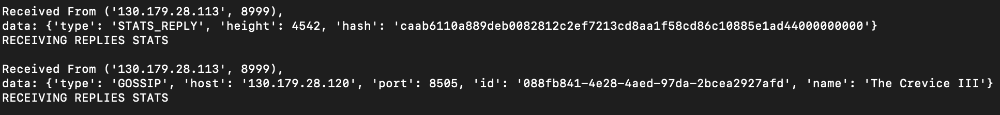
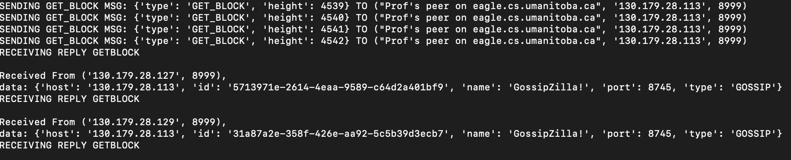
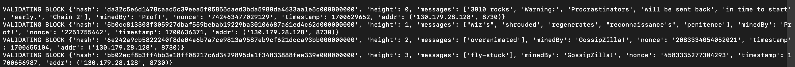
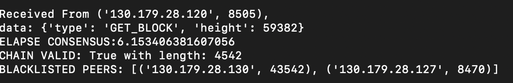
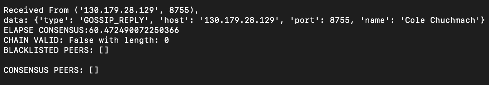

# README DETAILS

1. How to start your peer, any command line arguments, and what to expect. How long does it take to synchronize, what will we see when it is synchronized
2. Tell us where your consensus code is - the part that chooses which chain to synchronize. Give us the name of the file, and the line number with a 2 sentence description of how it does it.
3. 2 sentences on how you clean up peers, give us the file name and line number for this, too

# 1. HOW TO RUN

- To **run** the program:

  - just type in 'python3 peer_no_miner.py [port_number]'

- To make things easier:

  - I've made some flag called 'README' for you to search so that you can find it easily where the important codes are.
  - So, just type in 'README' in the source code and you will see where the main section of the codes are.

- What to **EXPECT**:

  - WHILE DOING CONSENSUS and STATS, you will see the prompt of "RECEIVING REPLIES STATS", this means that the program is still doing consensus and receiving stats replies.
    

  - WHILE GETTING BLOCKS, it will first send get block message to peers, and "RECEIVING REPLY GETBLOCK" means that it is still receiving blocks from peers. It will keep requesting blocks until all the chain is fullfiled.
    

  - WHILE VALIDATING CHAIN, it will validates chain when all the blocks are received and fullfilled.
    

    - During the chain validation, if one of the block is invalid, it will blacklist the peer that sends that block.
    - It will try to finish validation process, and do another consensus.

- How long to **synchronize**:

  - To synchronize around ~4000 blocks, it takes about 1 minute. If there's an invalid higher chain, it will take longer to sync since it needs to get all those invalid block in the chain check it block-by-block and blacklist the peer that has that chain and restart the process.

  - When it is synchronized you will see the print statement of "CHAIN VALID: True with length: [length_num]". Below is the example picture when the peer is synchronized 
  - When it is **NOT** synchronized you will see the "Chain Valid" to be false.
    

# 2. Consensus Process

- Where:

  - Line numbers: 500-626.

    - You can also find it by searching this 'README: CONSENSUS CODE'

  - File name: peer_no_miner.py

- How:
  1. First, inside handleConsensus(), it will send_stats() to all of my peers.
  2. At the specified amount of time, it will try to receive all those stat replies and saves it. During this time, it can also handle other response.
  3. After getting all those stat replies, it will get the result of the consensus, inside the get_consensus_list(). This function will return the highest and most agreed chain.
  4. After getting those peers with the highest and most agreed chain, it will get blocks from all those peers.

# 3. Clean Up Peers

- Where:

  - Line numbers: 132-159

    - You can also find it by searching this 'README: CLEAN PEERS CODE'

  - File name: peer_no_miner.py

- How:
  - inside the do_gossip() method. It will always either remove a peer when it reaches a timeout, renew a peer, or add a new peer to my peer list.
  - How does the timeout work:
    1. when adding new peer, it will have time.time() + TIMEOUT.
    2. Then, in every gossip that's received, it will remove and clean up the peers if the current time is > time.time() + TIMEOUT.
